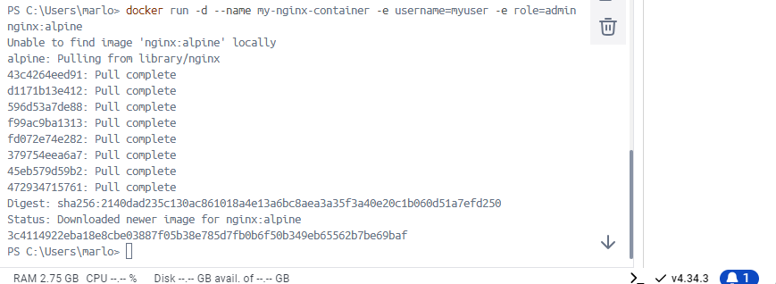
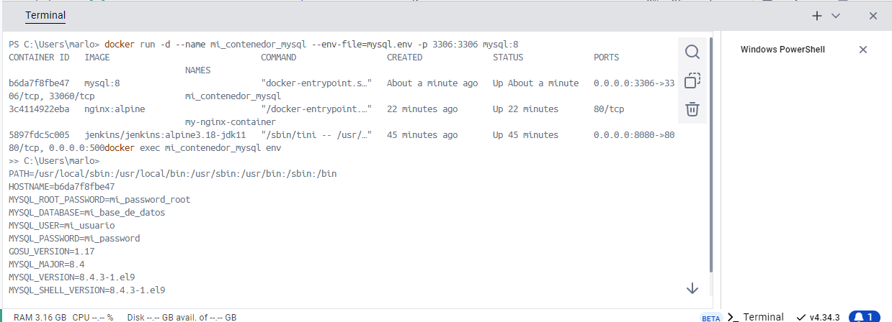

# Variables de Entorno
### ¿Qué son las variables de entorno
Las variables de entorno son valores dinámicos que pueden afectar el comportamiento de procesos en un sistema operativo. Estas variables almacenan información que puede ser utilizada por las aplicaciones o el propio sistema para determinar configuraciones específicas, como la localización de archivos ejecutables, rutas de directorios, configuración de usuario, entre otros.

### Para crear un contenedor con variables de entorno?

```
docker run -d --name <nombre contenedor> -e <nombre variable1>=<valor1> -e <nombre variable2>=<valor2>
```

### Crear un contenedor a partir de la imagen de nginx:alpine con las siguientes variables de entorno: username y role. Para la variable de entorno rol asignar el valor admin.

```
docker run -d --name my-nginx-container -e username=myuser -e role=admin nginx:alpine
```

# CAPTURA CON LA COMPROBACIÓN DE LA CREACIÓN DE LAS VARIABLES DE ENTORNO DEL CONTENEDOR ANTERIOR

### Crear un contenedor con mysql:8 , mapear todos los puertos
```
docker run -d --name my-mysql-container -e MYSQL_ROOT_PASSWORD=my-secret-pw -p 3306:3306 mysql:8
```
### ¿El contenedor se está ejecutando?
Efectivamente, se puede observar que el contenedor se está ejecutando.

### Identificar el problema
Si hacemos un log al contenedor, se llega a observar que existen múltiples advertencias en las que se indica que MYSQL no puede cargar correctamente los archivos de zona horaria.

### Eliminar el contenedor creado con mysql:8 
```
docker stop my-mysql-container
```
y posterior
```
docker rm my-mysql-container
```

### Para crear un contenedor con variables de entorno especificadas
- Portabilidad: Las aplicaciones se vuelven más portátiles y pueden ser desplegadas en diferentes entornos (desarrollo, pruebas, producción) simplemente cambiando el archivo de variables de entorno.
- Centralización: Todas las configuraciones importantes se centralizan en un solo lugar, lo que facilita la gestión y auditoría de las configuraciones.
- Consistencia: Asegura que todos los miembros del equipo de desarrollo o los entornos de despliegue utilicen las mismas configuraciones.
- Evitar Exposición en el Código: Mantener variables sensibles como contraseñas, claves API, y tokens fuera del código fuente reduce el riesgo de exposición accidental a través del control de versiones.
- Control de Acceso: Los archivos de variables de entorno pueden ser gestionados con permisos específicos, limitando quién puede ver o modificar la configuración sensible.

Previo a esto es necesario crear el archivo y colocar las variables en un archivo, **.env** se ha convertido en una convención estándar, pero también es posible usar cualquier extensión como **.txt**.
```
docker run -d --name <nombre contenedor> --env-file=<nombreArchivo>.<extensión> <nombre imagen>
```
**Considerar**
Es necesario especificar la ruta absoluta del archivo si este se encuentra en una ubicación diferente a la que estás ejecutando el comando docker run.

### Crear un contenedor con mysql:8 , mapear todos los puertos y configurar las variables de entorno mediante un archivo
```
docker run -d --name mi_contenedor_mysql --env-file=mysql.env -p 3306:3306 mysql:8
```

# CAPTURA CON LA COMPROBACIÓN DE LA CREACIÓN DE LAS VARIABLES DE ENTORNO DEL CONTENEDOR ANTERIOR 

### ¿Qué bases de datos existen en el contenedor creado?
Existen 5 bases de datos listadas en el contenedor.
