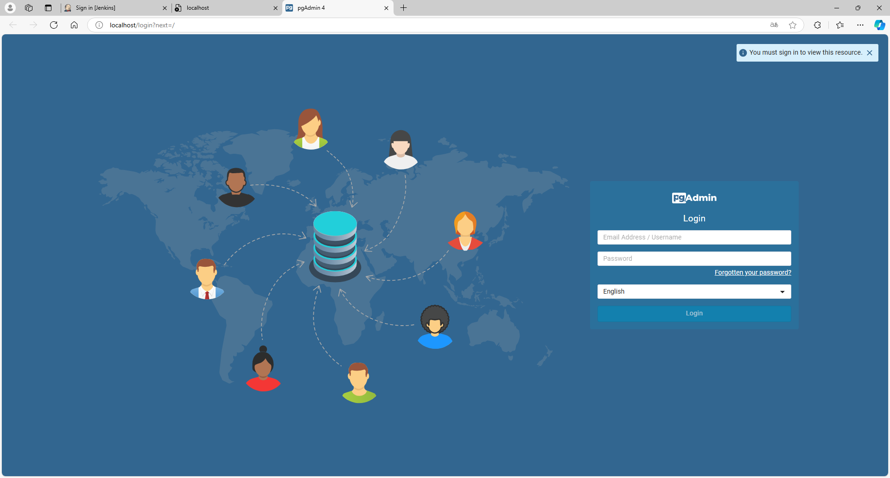
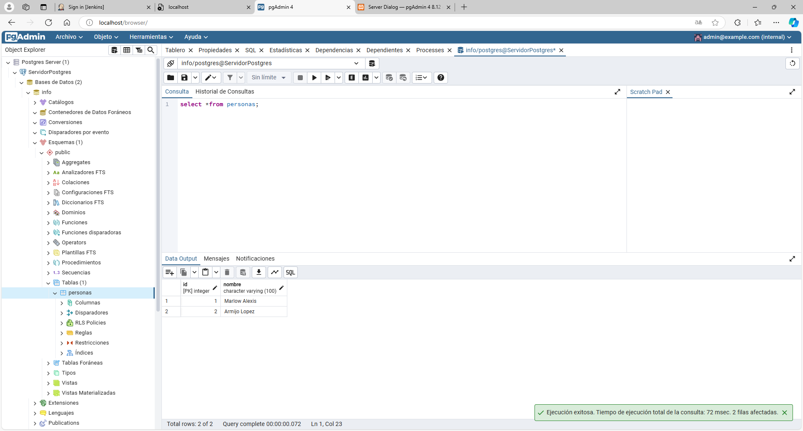
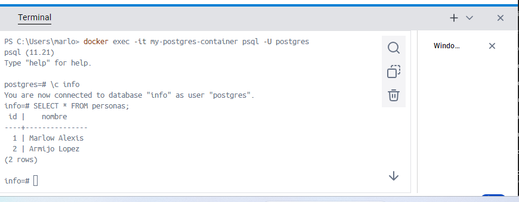

### Crear contenedor de Postgres sin que exponga los puertos. Usar la imagen: postgres:11.21-alpine3.17
```
docker run -d --name my-postgres-container -e POSTGRES_PASSWORD=mysecretpassword postgres:11.21-alpine3.17
```

### Crear un cliente de postgres. Usar la imagen: dpage/pgadmin4

```
docker run -d --name my-pgadmin-container -e PGADMIN_DEFAULT_EMAIL=admin@example.com -e PGADMIN_DEFAULT_PASSWORD=admin -p 80:80 dpage/pgadmin4

```

La figura presenta el esquema creado en donde los puertos son:
- a: (completar con el valor)
- b: (completar con el valor)
- c: (completar con el valor)


## Desde el cliente
### Acceder desde el cliente al servidor postgres creado.

### Crear la base de datos info, y dentro de esa base la tabla personas, con id (serial) y nombre (varchar), agregar un par de registros en la tabla, obligatorio incluir su nombre.

## Desde el servidor postgresl
### Acceder al servidor
```
docker exec -it my-postgres-container psql -U postgres
```
### Conectarse a la base de datos info
```
\c info
```

### Realizar un select *from personas
```
SELECT * FROM personas;
```
# AGREGAR UNA CAPTURA DE PANTALLA DEL RESULTADO

