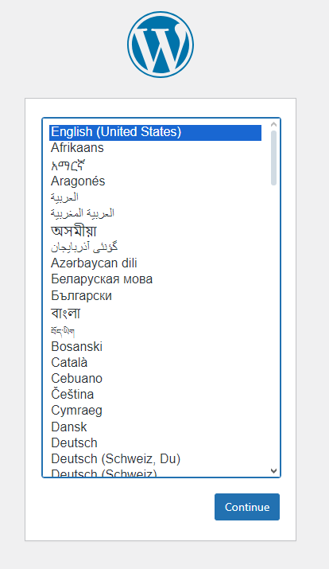
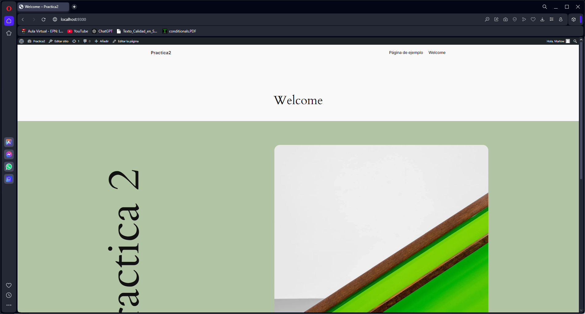

## Esquema para el ejercicio


### Crear la red
# COMPLETAR
```
docker network create net-wp
```
### Crear el contenedor mysql a partir de la imagen mysql:8, configurar las variables de entorno necesarias
```
docker run -d --name mysql --network net-wp --env-file mysql2.env mysql:8
```

### Crear el contenedor wordpress a partir de la imagen: wordpress, configurar las variables de entorno necesarias
```
docker run -d --name wordpress --network net-wp -p 9300:80 --env-file wordpress.env wordpress
```

De acuerdo con el trabajo realizado, en la el esquema de ejercicio el puerto a es 9300

Ingresar desde el navegador al wordpress y finalizar la configuración de instalación.



Desde el panel de admin: cambiar el tema y crear una nueva publicación.
Ingresar a: http://localhost:9300/ 
recordar que a es el puerto que usó para el mapeo con wordpress
# COLOCAR UNA CAPTURA DEL SITO EN DONDE SEA VISIBLE LA PUBLICACIÓN.

### Eliminar el contenedor wordpress

```
docker rm -f wordpress
```

### Crear nuevamente el contenedor wordpress

Ingresar a: http://localhost:9300/ 
recordar que a es el puerto que usó para el mapeo con wordpress

### ¿Qué ha sucedido, qué puede observar?
al volver a abrir la dirección llegue a observar que no cambio nada en la página, me apreció tal cual la había dejado antes de eliminar el contenedor.


